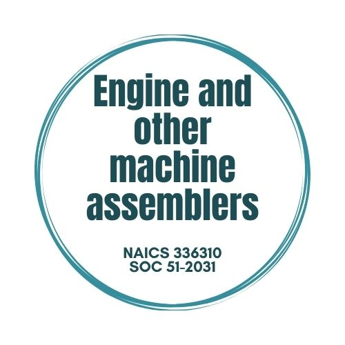

# **AirLIMP**

## _NAICS - 336310 - Motor Vehicle Gasoline Engine and Engine Parts Manufacturing_



INSERTAR IMAGEN DE PRODUCTION PROCESS

### ONET - Tasks & matched skills for Managers, Engineers & Operators

### FORECASTING:
- Firm's number of available workers
- Firm's number of demand workers

INSERTAR LA TABLA - PARTE DE LEYRE


### JOB POSTINGS:

INSERTAR IMAGEN DE JOB POSTINGS 


### Markdown

Markdown is a lightweight and easy-to-use syntax for styling your writing. It includes conventions for

```markdown
Syntax highlighted code block

# Header 1
## Header 2
### Header 3

- Bulleted
- List

1. Numbered
2. List

**Bold** and _Italic_ and `Code` text

[Link]() and 
```

For more details see [GitHub Flavored Markdown](https://guides.github.com/features/mastering-markdown/).

### Jekyll Themes

Your Pages site will use the layout and styles from the Jekyll theme you have selected in your [repository settings](https://github.com/Ainhoa-Urtasun-UPNA/hohr-project-group-assignment-airlimp/settings/pages). The name of this theme is saved in the Jekyll `_config.yml` configuration file.

### Support or Contact

Having trouble with Pages? Check out our [documentation](https://docs.github.com/categories/github-pages-basics/) or [contact support](https://support.github.com/contact) and we’ll help you sort it out.
