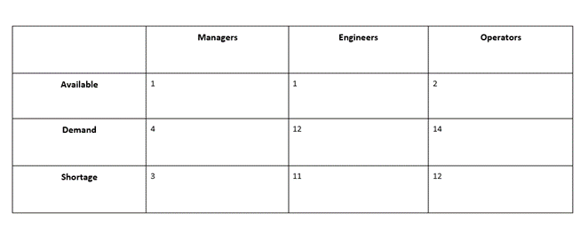

# **AirLIMP**

## **Working for a better environment**

### _NAICS - 336310 - Motor Vehicle Gasoline Engine and Engine Parts Manufacturing_

### ONET - Tasks & matched skills for Managers, Engineers & Operators

### FORECASTING:
Firm's number of available workers
- Managers: 1
- Engineers: 1
- Operators: 2

Firm's number of demand workers
- Managers: 4
- Engineers: 12
- Operators: 14

### JOB POSTINGS:

